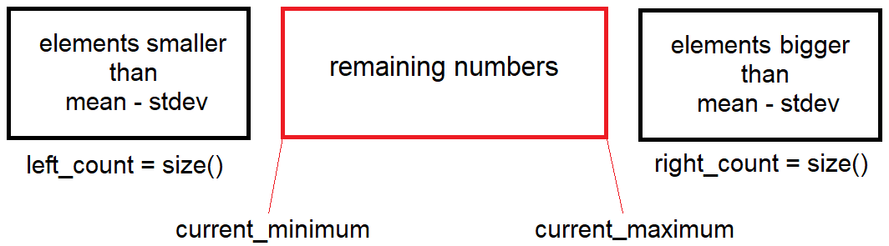
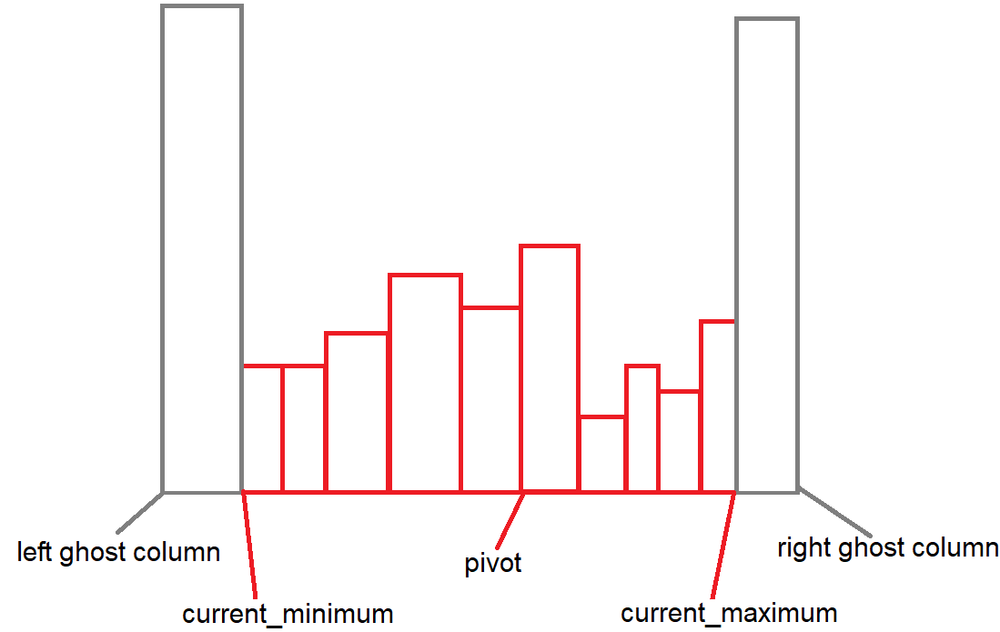

This document will explain how I solved each of the problems described in the project specifications.

\newpage
# Problem 1

## Quesion

What are the minimum and maximum values, the average, and the variance?

## Answer

For this problem, the built-in spark functions \textit{rdd.min(), rdd.max(), rdd.mean()} were used to provide the following results:

* minimum: 1.01311593426e-06

* maximum: 97.999993121

* average: 42.060411373468106

* variance: 193.2777614391939

\newpage
# Problem 2

## Quesion

What is the value of the median of the data set? You should provide the exact median, not an approximation, and sorting the complete data set or using the .median() or .quantile() functions are not acceptable solutions.

## Answer

Before answering this question, I will describe the process taken to solve it.

Firstly, we use the theorem that says the median must be one standard deviation away from the mean @median. From the functions in Problem 1, we know the mean and variance, from which we can extract the standard deviation. Hence, the first step is to filter out the values which are not within this range, using \textit{rdd.filter(lambda x: x >= average - sd)} and \textit{rdd.filter(lambda x: x <= average + sd)}. Hence, if our list was sorted, we would have the following diagram:

Through this, we eliminate a lot of values, hence narrowing furter into our median. We calculate the current minimum and maximum of the remaining elements so that they are used in the next step.

The next step is to divide them into a histogram which is evenly split into 10 bins between the \textit{current\_minimum} and \textit{current\_maximum} in order to study the distribution of our data. It was earlier tried to take a small random sample from the remaining numbers using \textit{rdd.sample(fraction)} and apply the histogram on this, however, this provided no speedup benefit. From this step, we may get a histogram like the following:

The left and right ghost columns represent the left\_count and right\_count we had earlier when we removed the values one standard deviation away from the mean. We chose a pivot based on this histogram, and also based on this histogram, we filter so that we try to get most values from the distribution, so that our median falls within the remaining elements.

Lets say for example that in this case we decide to remove all values right of the pivot. The remaining elements will be those on the left.

* If the \textit{number of elements on the left + left\_count > number of elements on the right + right\_count}, then we do \textit{right\_count += number of elements on the right} and continue

* Else, we filter again on the pivot, but this time only leave items which lie on the right, do \textit{left\_count += number of elements on the left} and continue

After this step we go back to histogramming the remaining elements.

There are 2 exit conditions:

* The left\_count and right\_count are equal
  * In this case we take do \textit{median = (max(left\_side) + min(right\_side)) / 2}
* The left\_side is 1 element bigger than the right\_side
  * In this case the \textit{median = max(left\_side)}
* The right\_side is 1 element bigger than the left\_side
  * In this case the \textit{median = min(right\_side)}

In our case we have exactly 1 billion elements, so we techincally only have the first exit condition.

Based on this algorithm, this was my answer:

* median: 42.0233594627

Note: Other optimizations were made in the codebase, such as caching results from heavy processes such as mapping strings to integers and repartitioning the RDD after a significant amount items have been filtered our.

\newpage
# Problem 3

To get the mode, we have 3 steps:

1. Get a list of tuples \textit{(element, count)}, where element is the individual elements - the numbers in our case. Count is the number of times that element appears in our collection.
2. Find the maximum of the count column
3. Return all the elements which have count = maximum count

To achieve step 1, we would need to map each element in our list to a tuple \textit{(element, 1)}, by using the map function: \textit{map(lambda x: (x, 1))}. Then we would need to reduce the elements by the key so that we add all the counts of a key, this is done using the following function: \textit{reduceByKey(lambda c1, c2: c1 + c2)}. We can do this as Spark takes the first item in our tuple, the element, to be the key, and the count to be our value.

To get the maximum count, we can do: \textit{rdd.max(key=lambda x: x[1]))}, where x is our tuple.

Lastly, we can filter out all elements whose values are not equal to the maximum using \textit{rdd.filter(lambda x: x[1] == maximum\_count)} and then removing the value by doing: \textit{rdd.map(lambda x: x[0])} and then collecting the values.

\newpage
# References
